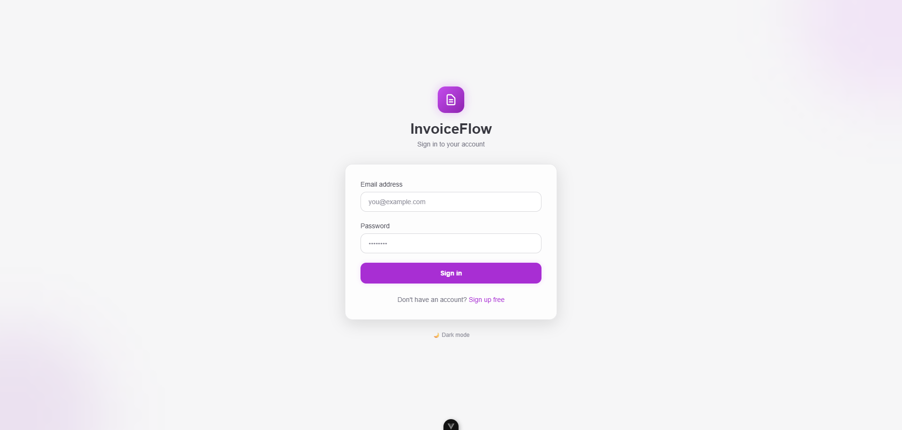
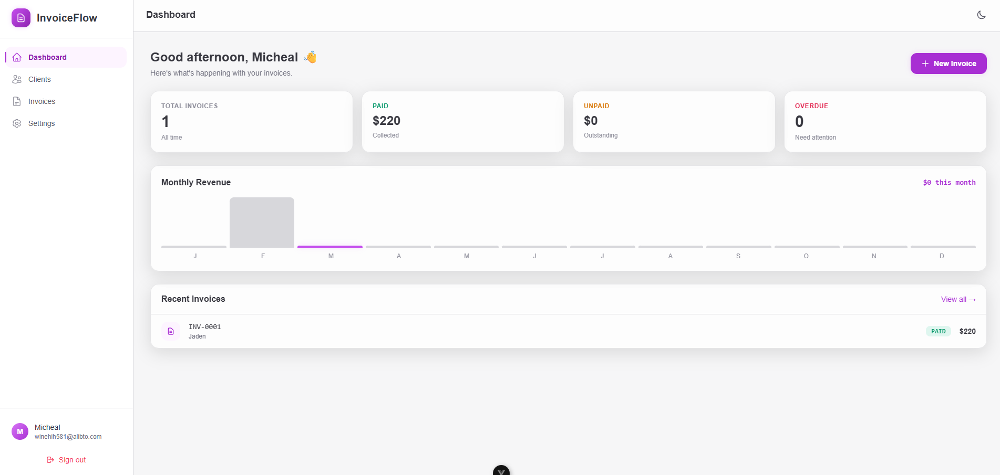
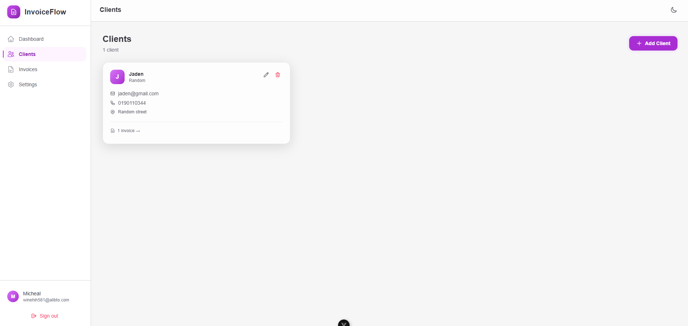
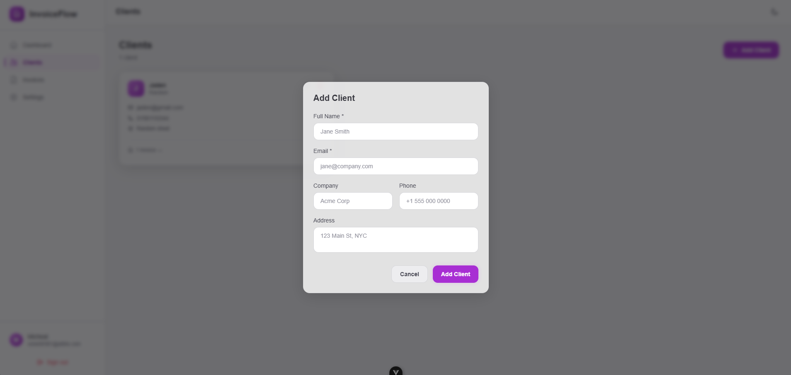
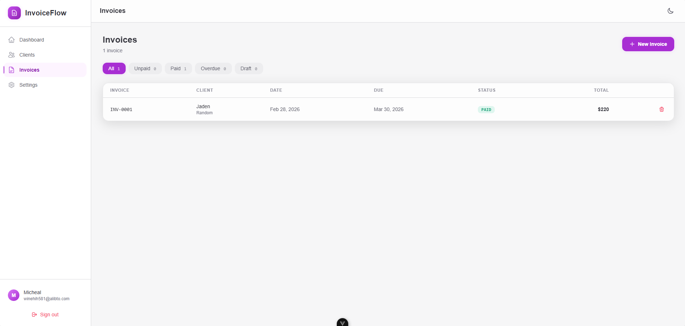
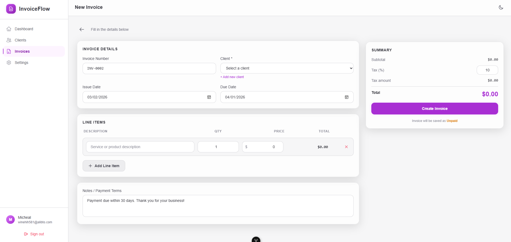
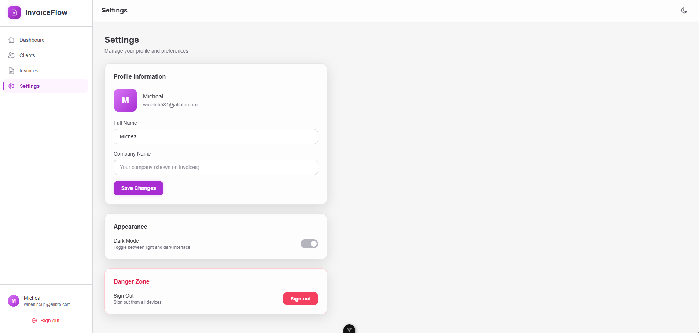

# 🚀 Simple Invoice Generator – Micro SaaS

A modern, responsive Micro SaaS Invoice Generator built with Vue 3, TypeScript, Tailwind CSS, and Supabase.

Freelancers hate creating invoices manually.
This app makes it simple to create, calculate, manage, and download professional invoices in seconds.

Inspired by tools like FreshBooks, but simplified and lightweight.

# 🛠 Tech Stack
🎨 Frontend

Vue 3 (Composition API)

TypeScript

Vue Router

Pinia (State Management)

Tailwind CSS

Light & Dark Mode

Fully Responsive Design

PDF Generation (jsPDF / html2pdf)

# 🗄 Backend

Supabase (Authentication + Database)

PostgreSQL (managed by Supabase)

# ✨ Features
👤 Client Management

Add new clients

Edit & delete clients

Save client history

🧾 Invoice Creation

Select client

Add dynamic invoice items

Auto-calculate:

Item total

Subtotal

Tax

Grand total

Mark invoice as Paid / Unpaid

📄 PDF Download

Generate professional invoice layout

Download as PDF instantly

No backend PDF processing required

📊 Dashboard

Total invoices

Total revenue

Unpaid amount summary

Recent invoices overview

# 🌓 UI/UX

Clean SaaS-style layout

Light / Dark mode toggle

Modern color palette

Mobile responsive

Component-based architecture


### 📷 **ScreenShots**

    

    

     

     

## Recommended Browser Setup

- Chromium-based browsers (Chrome, Edge, Brave, etc.):
  - [Vue.js devtools](https://chromewebstore.google.com/detail/vuejs-devtools/nhdogjmejiglipccpnnnanhbledajbpd)
  - [Turn on Custom Object Formatter in Chrome DevTools](http://bit.ly/object-formatters)
- Firefox:
  - [Vue.js devtools](https://addons.mozilla.org/en-US/firefox/addon/vue-js-devtools/)
  - [Turn on Custom Object Formatter in Firefox DevTools](https://fxdx.dev/firefox-devtools-custom-object-formatters/)

## Type Support for `.vue` Imports in TS

TypeScript cannot handle type information for `.vue` imports by default, so we replace the `tsc` CLI with `vue-tsc` for type checking. In editors, we need [Volar](https://marketplace.visualstudio.com/items?itemName=Vue.volar) to make the TypeScript language service aware of `.vue` types.

## Customize configuration

See [Vite Configuration Reference](https://vite.dev/config/).

## Project Setup

```sh
npm install
```

### Compile and Hot-Reload for Development

```sh
npm run dev
```

### Type-Check, Compile and Minify for Production

```sh
npm run build
```

### Lint with [ESLint](https://eslint.org/)

```sh
npm run lint
```
